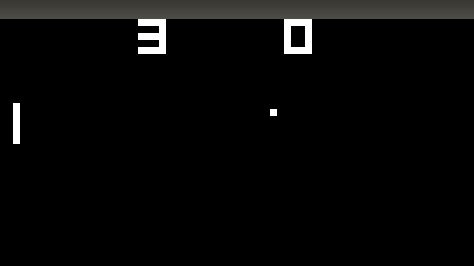
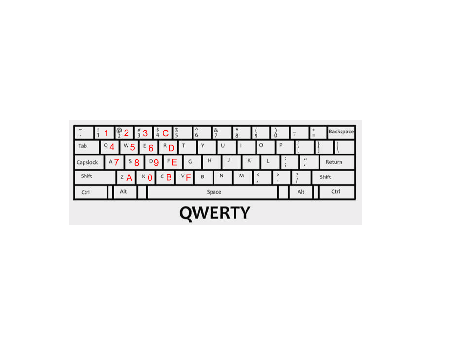

# How to Build a Multithreaded Gameserver (In Rust!) Part 1

## Intro

Ever since I played through [Final Fantasy VII](https://en.wikipedia.org/wiki/Final_Fantasy_VII) (a Playstation game from 1997) and finally beat Sephiroth on my Windows computer I've been interested in emulators. The idea that a computer does not have to be an impenetrable hunk of plastic and silicon, but an understandable system of instructions and responses, is for me strangely uplifting. So during the pandemic I finally mustered the willpower to sit down and learn more by implementing my own simple [CHIP-8](https://en.wikipedia.org/wiki/CHIP-8) emulator in Rust. Since there [are](http://www.multigesture.net/articles/how-to-write-an-emulator-chip-8-interpreter/) [a](https://www.freecodecamp.org/news/creating-your-very-own-chip-8-emulator/) [lot](https://blog.scottlogic.com/2017/12/13/chip8-emulator-webassembly-rust.html) of CHIP-8 tutorials out there, I extended mine by building a multithreaded gameserver on top of it, so during the pandemic you can share a URL with your friend and play PONG!

If you want to jump right into the code, go to [this repo for the standalone emulator](https://github.com/melvillian/chipotle8), and [this repo for the multithreaded gameserver (still a WIP!)](https://github.com/melvillian/chipotle8-server).

My foremost goal is to demystify the concepts and implementation of a multiplayer gameserver emulator. By the end of this series you'll know enough to write your own CHIP-8 emulator in your favorite language, and you'll see one way of dealing with the problems that arise in multithreaded networked environments, like shared memory, network latency, and server load.

## Brief Outline

- What Is An Emulator?
- What Is Rust and Systems Programming?
- What is CHIP-8
- `chipotle8` Project Structure
- The Game Loop
- Some Example Opcodes and Their Implementation
- Conclusion to Part 1

## What Is An Emulator? (Or, Taking the Red Pill)

verb (used with object), em·u·lat·ed, em·u·lat·ing.
1. to try to equal or excel; imitate with effort to equal or surpass:
3. Computers:
   1. to imitate (a particular computer system) by using a software system,

"_You take the blue pill, the story ends, you wake up in your bed and believe whatever you want to believe. You take the red pill... you stay in Wonderland, and I show you how deep the rabbit hole goes_."

\- Morpheus

In the absolute classic The Matrix, the protagonist Neo must grapple with the fact that his entire life has been a synthetic farce, a reality emulating the world prior to the rise of the human-harvesting AI. Until Morpheus clues him in to the real world Neo had only a whisper of a feeling that there was something off about his world. To him and his sensory inputs, The Matrix was near-indistinguishable from the real.

An emulator is a piece of software which when given an input (usually a game file or executable program) will execute the same instructions and respond to I/O devices exactly as the device (usually a piece of hardware such as a Gameboy or Playstation) it is emulating. Some well known emulators are [Visual Boy Advance for Gameboy Advance](http://www.emulator-zone.com/doc.php/gba/vboyadvance.html) and [ePSXe for Playstation](http://www.emulator-zone.com/doc.php/psx/epsxe.html).

Image:
https://www.google.com/imgres?imgurl=https://i.ytimg.com/vi/b4eyHykOD70/maxresdefault.jpg&imgrefurl=https://www.youtube.com/watch?v%3Db4eyHykOD70&tbnid=wD9UAkVWLjb-XM&vet=1&docid=Zf2k5_y5CU817M&w=1280&h=720&hl=en&source=sh/x/im

In this blog series we'll be implementing a [CHIP-8 Emulator](https://en.wikipedia.org/wiki/CHIP-8) which ran 70's classics like [Pong](https://en.wikipedia.org/wiki/Pong#Gameplay) and [Space Invaders](https://en.wikipedia.org/wiki/Space_Invaders) using Rust.

## What Is Rust and Why Use It For A Multiplayer Gameserver?

[Rust](https://www.rust-lang.org/) is a relatively new computer programming language that feels like a mix between Haskell and C. On its front page we see it focuses on "performance, reliability, and productivity. While the [performance is undeniable](https://benchmarksgame-team.pages.debian.net/benchmarksgame/fastest/rust.html) and I have some anecdata and personal experience that once you get a Rust program to compile it will reliably run without you babysitting it, the productivity claim is... nuanced. Maybe it's productive in the same way that [vim](https://vim-adventures.com/) is productive once you pour days into learning the new concepts and [come to terms with the borrow checker](http://xion.io/post/code/rust-borrowchk-tricks.html). And I can definitely see how it's productive once you have a 100,000+ line codebase with 20+ people working on it needing to get shit done without [spooky action at a distance](https://en.wikipedia.org/wiki/Action_at_a_distance_%28computer_programming%29). However when you are first learning Rust and trying to do basic things like `String` manipulation or creating a new thread, it's probably going to take an order of magnitude longer _at first_ for you to do it because the Rust compiler is very clever and will try to stop you from shooting yourself in the foot. Thus causing you to bend backwards in order to do something [as simple as `String` concatenation](https://stackoverflow.com/questions/30154541/how-do-i-concatenate-strings).

So if Rust is a pain to use as a beginner, why am I using it to write my first software foray into multiplayer gaming? A good reason is that I need my game server to be fast so that it can be cheap. I need to pay for every [AWS EC2 instance](https://en.wikipedia.org/wiki/Amazon_Elastic_Compute_Cloud) running my game servers, and I predict each game server will max out its virtualized hardware resources as it handles many simultaneous pairs of players. If I went with a programming language that is on average 10 times as slow as something like Rust, I'll need to pay roughly 10 times as much to support the same number of players. Another good reason is flexibility via [Rust's support for WebAssembly](https://www.rust-lang.org/what/wasm). If I can write the emulator in a language that can compile down to `wasm`, then I could eschew the client/server model entirely and instead go with a peer-to-peer approach [using WebRTC](https://en.wikipedia.org/wiki/WebRTC) where when 2 players create a game together, one of them is randomly chosen to run the emulator in the browser and the game progresses without any communication to a server. But really if I'm going to be honest, the primary reason to write this in Rust is personally I find this language very modern and powerful, and I want to write more in it.

## What Is CHIP-8?

Enough on motivation, let's dive into what an emulator really looks like, in particular an emulator for the CHIP-8 system. We're basically designing a computer, so we need to do know what components make up such a computer. Below I give an exhaustive list and a short explanation of all CHIP-8 components (Note, [The wiki article on CHIP-8](https://en.wikipedia.org/wiki/CHIP-8) is a wealth of information on the CHIP-8 if you want to deep dive).

### CHIP-8 Components

- Display
- Keyboard
- Memory
- Registers
- Op Codes
- Timers

#### Display



The CHIP-8 display is represented as a nested array with 32 rows and 64 columns of unsigned 32-bit integers (`u32`'s). Let's call them pixels. Each pixel only takes 2 values, `0x00FF_FFFF` for white and `0x0000_0000` for black. We'll be using functions like `get_pixels(&mut self) -> &[u32]` and `xor_set(&mut self, x: u8, y: u8, enabled: bool) -> bool` to read and write our display.

#### Keyboard



The CHIP-8 uses a hexadecimal keyboard, a keyboard with 16 possible values 0-F. We'll be mapping 16 keys in the left side of your standard [QWERTY keyboard](https://en.wikipedia.org/wiki/QWERTY) to these CHIP-8 internal keys,.

#### Memory

Remember when I said the CHIP-8 is from the 70's? Turns out they made due with 1_000_000 times less RAM than we do today, and our CHIP-8 emulator is only going to have 4096 bytes of RAM (so little!). And to make matters even more cramped, since the hardware running the original CHIP-8 systems stored the CHIP-8 interpreter binary itself in bytes 0-511 of memory, there's really 4096 - 512 == 3584 bytes available for the game to store itself and manipulate whilst in play*. We'll use a static array of bytes, `[u8; 4096]`, to hold the emulator's RAM.

#### Registers

Here we begin to introduce the components of a computer, and thus an emulator, that are usually too low level to come up in day-today application software development (think web, mobile or desktop programming). At a high level a [register](https://en.wikipedia.org/wiki/Processor_register) are is a like memory in that it's a location on the computer where a processes 0's and 1's get stored, but unlike memory in that the registers store very extremely little data and are many orders of magnitude faster to read and write compared to main memory. Our CHIP-8 emulator has 17 registers in total. 16 of them are labeled `V0`, `V1`, `V2`, ... `VE`, `VF` and are a [type of register](https://en.wikipedia.org/wiki/Processor_register#Types) we call data registers because they are meant to store arbitrary bytes of data (for instance `V3 = 0x01`). The last register, labeled `I`, is an address register because it is meant to store a single one of the CHIP-8 system's 16-bit addresses. The majority of the work our emulator does will be very simple instructions like moving data in between registers and memory, and performing arithmetic on data in the registers (for instance, there is an instruction that takes two registers `VX` and `VY`, where `X` and `Y` are one of our 16 data registers, and loads the byte value in `VY` into `VX`). Registers are the building blocks of our emulator so we'll be referencing them all throughout this blog post. One last thing to keep in mind about registers is that computer architecture designers will often designate one or more registers to have special responsibilities beyond only storing data or addresses. In our case this special register is `VF`. No well-designed games for the CHIP-8 use the `VF` register, because the CHIP-8 system uses it as a [flag register](https://en.wikipedia.org/wiki/Status_register#Common_flags) so it can keep track of when arithmetic instructions result in overflow or underflow, as well as pixel value changes when the display gets redrawn. These special registers' abilities serve as a convenience for game programmers so they can keep track of often-used program state (like if their most recent display redraw caused any pixel collisions, and they should eliminate one of their sprites because it was hit by a bullet).

#### Instructions (Op Codes)

For anyone who's worked with [assembly](https://en.wikipedia.org/wiki/Assembly_language) before, op codes may bring warm (or maybe horrific?) memories. Op codes (we'll also call them instructions) makeup the brain of our emulator; they are how our emulator gets shit done. Need to draw some pixels to the screen? Give our emulator the op code like `DispDraw`/`0xDXYN`, when executed by the emulator, will take `N` bytes worth of bits starting at the address in the `I` register and copy them to the display starting at `X` and `Y` coordinates. Remember that example up in #### Registers with `VX` and `VY`? That would be the `AssignVyToVx`/`0x8XY0` op code, which copies the contents of register `VY` into register `VX`. In these and all future examples the `X` and `Y` are variables which can take any hexadecimal value `0x00` through `0x0F`.

A note for those wondering where names like `DispDraw` and `AssignVyToVx` came from. In each of the two examples above I gave 2 different names for the same op code. `AssignVyToVx` is the name of the enum variant I chose to use to make it human readable, but just like how assembly is simpling a mapping of human-readable words like [`mov ebx, 32`](http://www.keil.com/support/man/docs/armasm/armasm_dom1361289878994.htm) to machine-readable hexadecimal like `8B 5D 32`, `AssignVyToVx` represents the machine-readable instruction `8XY0` (where `X` and `Y` are hexadecimal numbers). I chose these names because they made sense to me and they're similar to the names given in the [wikipedia article for CHIP-8](https://en.wikipedia.org/wiki/CHIP-8#Opcode_table), but if you read about other CHIP-8 emulator implementations you will see different names. Call it my personal touch :).

The bulk of our work on `chipotle8` will be implementing the handlers for CHIP-8's 35 op codes. Some will only be a few lines of code, like `AssignVyToVx`, and others will be 50+ lines of code (usually those dealing with IO like taking input from the keyboard or putting output to the display).

#### Timers

Our emulator will need a way to know about the players' passage of time, otherwise Pong paddles will zip across the board at 60 frames a second, and our emulator's cute beeping sound will only ring for a fraction of a second. Timers serve to synchronize the players' human-speed experience of the game with the emulator's comparatively blazing fast execution of the game. CHIP-8 has 2 timers we'll need to implement; a delay timer and a sound timer. Both timers are actually just `u8` values which we will make decrement every 16.666 milliseconds (a.k.a 60 Hz). So if a game program wants to remind itself to do something in 1 second, it will set the `delay_timer` to `60 * 1 = 60` and then perform an instruction only when the delay timer's value is 0. Similarly, if the game program wants to exalt player 1's victory with a glorious beep for 4 seconds, it will set the `sound_timer` to `60 * 4 = 240`, knowing that we've implemented our emulator such that whenever `sound_timer` is not equal to 0, we'll play a beep sound.

## `chipotle8` Project Structure

Before we dive into implementation, let's get an overview of what this project is going to look like

```zsh
➜  chipotle8 git:(master) ✗ tree -I target # we don't bother showing the cargo artifacts in ./target
.
├── Cargo.lock
├── Cargo.toml
├── examples
│   └── pong.rs
├── games
│   ├── 15PUZZLE
│   ├── BLINKY
│   ├── BLITZ
│   ├── BRIX
│   ├── CONNECT4
│   ├── GUESS
│   ├── HIDDEN
│   ├── INVADERS
│   ├── KALEID
│   ├── MAZE
│   ├── MERLIN
│   ├── MISSILE
│   ├── PONG
│   ├── PONG2
│   ├── PUZZLE
│   ├── SYZYGY
│   ├── TANK
│   ├── TETRIS
│   ├── TICTAC
│   ├── UFO
│   ├── VBRIX
│   ├── VERS
│   └── WIPEOFF
├── README.md
└── src
    ├── graphics.rs
    ├── keyboard.rs
    ├── lib.rs
    ├── lib_test.rs
    └── op.rs

3 directories, 32 files
```

`examples/` is a standard directory in Rust projects that contain files containing a `fn main()` function for running examples. If there exists a file `examples/pong.rs` in the root directory, you can run `cargo run --example pong` and it will execute the `main` function in `examples/pong.rs`.

`games/` is a directory of public games written for the CHIP-8 emulator that we will load byte-by-byte into our emulator in order to play.

Within `src/`, `graphics.rs` holds the logic for representing and drawing the 64x32 CHIP-8 display, `keyboard.rs` holds the logic for handling keyboard input and keyboard-related op codes, `op.rs` is a small file holding our `Op` [`enum`](https://doc.rust-lang.org/rust-by-example/custom_types/enum.html), and finally `lib.rs` holds our op code handlers and the `Emulator` [`struct`](https://doc.rust-lang.org/rust-by-example/custom_types/structs.html) itself.

## The Game Loop

At the end of the day, most every game has some sort of endless loop code which runs the game. Let's take a look at what our's will look like so we can get a high level idea of how our game is going to run**.

```rust
while window.is_open() {
    // execute the current instruction
    if let Some(op) = emulator.cycle() {
       // redraw the display if it changed
        if op.is_display_op() {
            let display = emulator.get_pixels();
            window.update_with_buffer(display, WIDTH, HEIGHT).unwrap();
        }
    }

    // check for key press changes and update the Emulator with which keys are up or down
    emulator.handle_key_input(&keyboard);
}
```

We execute the current instruction, which will most likely update some registers, but may also write data to memory, update the internal display buffer, or even halt the emulator while it waits for a certain key to be pressed. Then we redraw the display pixels. Since redrawing is by far the most costly action for the emulator to do, we optimize by only redrawing when the just-executed instruction changed the internal display buffer. Finally, we update the emulator's state of pressed and released keys. Looking at it from 10,000 feet you could say all we're doing, over and over again, is

1. advance the program's state
2. handle output
3. handle input

This is worth mentioning because every GUI application is like this, running in a constant loop. It performs whichever action the program is meant to do (save a text document, process spreedsheets, check for twitter updates, etc.) and then handle IO.

## Some Example Opcodes and Their Implementation

You now have all the knowledge you need to implement a CHIP-8 emulator. Let's look at a couple interesting op codes, IO, and tests to see what the future holds.

### The Emulator `struct`

First off, since everything centers around the `Emulator`, we'll look at that first.

```rust
/// Stores the registers, memory, timers, and any other data necessary to run the emulator.
///
/// # Examples
///
/// ```no_run
/// # use std::io::Error;
/// # use chipotle8::Emulator;
/// # fn main() -> Result<(), Error> {
/// let mut emulator = Emulator::with_game_file("games/PONG")?;
///
/// // execute the first two instructions of the `PONG` game
/// emulator.cycle();
/// emulator.cycle();
/// #    Ok(())
/// # }
pub struct Emulator {
    memory: [u8; 4096], // 4k of RAM

    sp: usize, // stack pointer for the 16-level
    // The stack pointer always points one beyond the top of the stack, i.e. onto
    // unallocated memory
    stack: [usize; 16],  // 16-level stack holding instructions
    I: Address,          // address instruction register
    prev_op: Option<Op>, // the instruction executed last cycle, used to know when to draw
    pc: usize, // program counter, only 16 bits are needed but we use usize so we can index with it

    // 16 8-bit registers. VF is used as a flag by several of the opcodes (see @Op)
    v: [u8; 16],

    graphics: Graphics, // 64x32 pixel monochrome screen

    keyboard: Keyboard, // Stores the state of all keyboard input

    delay_timer: u8,                    // 60 Hz timer that can be set and read
    delay_timer_settime: time::Instant, // the instant we last set the delay_timer
    sound_timer: u8,                    // 60 Hz timer that beeps whenever it is nonzero
    sound_timer_settime: time::Instant, // the instant we last set the sound_timer
    logger: Arc<Logger>,
}
```

There are a couple new ideas here, specifically the `pc`, `stack`, and `sp` fields. Again, those familiar with systems programming will immediately see the need for these fields, but since I hope most readers are coming from a high level language it is definitely worth going into. If the following explanation still leaves you stratching your head, the Rust devs [have a great explanation in the first edition of The Book](https://doc.rust-lang.org/1.22.0/book/first-edition/the-stack-and-the-heap.html).

The `pc` stands for "program counter", and its simple job is to store the memory address of the next instruction to be executed. When a game is first loaded into address 512 (remember where up above we said the first 512 bytes are reserved for the interpreter itself?) the program counter is also set to be 512 so that we will execute the first instruction in the game file.

`stack` is, as you would expect [a Stack data structure](https://en.wikipedia.org/wiki/Stack_(abstract_data_type)) whose purpose is to help store the return addresses of CHIP-8's "function calls". CHIP-8 doesn't have functions per se, but it does have the `GotoSubRtn` op code which when executed pushes the current value of the `pc` onto the `stack` and then moves the `pc` to whichever memory address was passed to `GotoSubRtn`. Later when the `Return` instruction is executed the `Emulator` will pop that instruction off the `stack` and into the `pc`. This is very similar to your day-to-day programming languages which use the stack to store return values when a function gets called. And just like in regular programming languges in CHIP-8 you can execute multiple `GotoSubRtn` (just like you have a function called within a function in a high level programming language) and the `sp` or "stack pointer" will point to the latest address pushed onto the stack by `GotoSubRtn`. `sp` stores the index in the `stack` of the latest address, so `sp` starts at 0 and increments by 1 every time `GotoSubRtn` gets called, and decrements by 1 every time `Return` gets called.

### Reading In Game Files

Before we do anything with `Emulator`, we need a way to instantiate it. For this `Emulator` exposes the `with_game_file_and_logger` function:

```rust
/// Creates an Emulator with a path to a CHIP-8 game file and an optional logger.
///
/// # Examples
///
/// ```
/// # use std::io::Error;
/// # use chipotle8::Emulator;
/// # fn main() -> Result<(), Error> {
/// let mut emulator = Emulator::with_game_file_and_logger("games/PONG", None)?;
///
/// # Ok(())
/// # }

pub fn with_game_file_and_logger<L: Into<Option<slog::Logger>>>(
  path_to_game_file: &str,
  logger: L,
) -> Result<Self, Error> {
    // Note: `Into` trick allows passing `Logger` directly, without the `Some` part.
    // See http://xion.io/post/code/rust-optional-args.html

    let mut emulator = Emulator::new(logger);
    let res = emulator.initialize(path_to_game_file);
    if res.is_ok() {
      Ok(emulator)
    } else {
      Err(res.err().unwrap())
    }
}
 ```

`initialize` does the bulk of the work, taking a `/path/to/game/file` `&str`.

```rust
/// Read in a game file and initialize the necessary registers.
///
/// Returns an error if we fail to open the game file
fn initialize(&mut self, path: &str) -> Result<(), Error> {
    let game_file = File::open(path).unwrap();

    self.read_game_file(game_file)?;
    self.sp = 0;
    self.pc = STARTING_MEMORY_BYTE;

    debug!(self.logger, "initialized emulator with game file: {}", path);

    Ok(())
}
```

Here `STARTING_MEMORY_BYTE` is equal to `512` since [the first 512 bytes were originally for the interpreter code itself, and we want to emulate the original hardware as much as we can](https://en.wikipedia.org/wiki/CHIP-8#Memory).

`read_game_file` is simply reading the game file bytes in from the `File` and then copying them into memory.

```rust
/// Read in a CHIP 8 game file and load it into memory starting at byte index 512
    fn read_game_file(&mut self, file: File) -> Result<(), Error> {
        let buf = read_file_to_vec(file)?;

        let err_msg = "file is too large".to_string();
        assert!(buf.len() < GAME_FILE_MEMORY_SIZE, err_msg);

        let game_file_range = STARTING_MEMORY_BYTE..(STARTING_MEMORY_BYTE + buf.len());
        self.memory[game_file_range].copy_from_slice(&buf);

        Ok(())
    }
```

### Op Codes

Remember that op codes (also called instructions) are 16-bit numbers that we are executable by our emulator, and do different things depending on what those 16-bits are. `0xFB0A` is an op code we've decided to give the enum variant name `KeyOpGet`. `0xFB0B` however is not an op code, because only a certain subset of all possible 16-bit numbers are interpretible as a CHIP-8 instruction.

We're going to have a helluva time debugging if we mistake `0xFB0B` for `0xFB0A`, so we want our emulator explicitly rule out the possibility of fat fingering op code numbers. Thanks to Rust's exhaustive and nested pattern matching abilities***, this is relatively straighforward.

In the snippet below you'll see the bulk of our `Op` `enum`'s code for converting from the raw `u16` numbers of our op codes to the more structured `Op`. While we could work directly with the `u16`'s ([check out this other CHIP-8 implementation in Rust](https://github.com/AlexEne/rust-chip8/blob/master/src/cpu.rs#L48) where the developer works only with `u16`'s) it will improve readability and refactorability if we give well-named types to the data we're working with.

Recall that a nibble is 4 bits (a nibble is less than a byte, right? :D) and LSB and MSB stand for least significant byte and most significant byte, respectively.

```rust
type Address = u16;

impl From<Address> for Op {
    fn from(item: Address) -> Self {
        let mask = 0xF;

        // these are the 4 nibbles of item, where nibb_1 is the MSB and nibb_4 is the LSB
        let nibb_1 = ((item >> 12) & mask) as Nibble;
        let nibb_2 = ((item >> 8) & mask) as Nibble;
        let nibb_3 = ((item >> 4) & mask) as Nibble;
        let nibb_4 = (item & mask) as Nibble;
        let nibbles = [nibb_1, nibb_2, nibb_3, nibb_4];

        let panic_msg = format!("unknown Address: {}", item);

        match nibbles {
            [0x0, n2, n3, n4] => match n4 {
                0x0 => Op::DispClear,
                0xE => Op::Return,
                _ => Op::CallRca(n2, n3, n4),
            },
            [0x1, n2, n3, n4] => Op::Goto(n2, n3, n4),
            [0x2, n2, n3, n4] => Op::GotoSubRtn(n2, n3, n4),
            [0x3, n2, n3, n4] => Op::CondVxEq(n2, n3, n4),
            [0x4, n2, n3, n4] => Op::CondVxNe(n2, n3, n4),
            [0x5, n2, n3, 0x0] => Op::CondVxVyEq(n2, n3),
            [0x6, n2, n3, n4] => Op::ConstSetVx(n2, n3, n4),
            [0x7, n2, n3, n4] => Op::ConstAddVx(n2, n3, n4),
            [0x8, n2, n3, n4] => match n4 {
                0x0 => Op::AssignVyToVx(n2, n3),
                0x1 => Op::BitOpOr(n2, n3),
                0x2 => Op::BitOpAnd(n2, n3),
                0x3 => Op::BitOpXor(n2, n3),
                0x4 => Op::MathVxAddVy(n2, n3),
                0x5 => Op::MathVxMinusVy(n2, n3),
                0x6 => Op::BitOpRtShift(n2),
                0x7 => Op::MathVyMinusVx(n2, n3),
                0xE => Op::BitOpLftShift(n2),
                _ => panic!(panic_msg),
            },
            [0x9, n2, n3, 0] => Op::CondVxVyNe(n2, n3),
            [0xA, n2, n3, n4] => Op::MemSetI(n2, n3, n4),
            [0xB, n2, n3, n4] => Op::GotoPlusV0(n2, n3, n4),
            [0xC, n2, n3, n4] => Op::Rand(n2, n3, n4),
            [0xD, n2, n3, n4] => Op::DispDraw(n2, n3, n4),
            [0xE, n2, n3, n4] => match [n3, n4] {
                [0x9, 0xE] => Op::KeyOpEqVx(n2),
                [0xA, 0x1] => Op::KeyOpNeVx(n2),
                _ => panic!(panic_msg),
            },
            [0xF, n2, n3, n4] => match [n3, n4] {
                [0x0, 0x7] => Op::DelayGet(n2),
                [0x0, 0xA] => Op::KeyOpGet(n2),
                [0x1, 0x5] => Op::DelaySet(n2),
                [0x1, 0x8] => Op::SoundSet(n2),
                [0x1, 0xE] => Op::MemIPlusEqVx(n2),
                [0x2, 0x9] => Op::MemISetSprite(n2),
                [0x3, 0x3] => Op::Bcd(n2),
                [0x5, 0x5] => Op::RegDump(n2),
                [0x6, 0x5] => Op::RegLoad(n2),
                _ => panic!(panic_msg),
            },
            _ => panic!(panic_msg),
        }
    }
}
```

Now that we have a clear picture of how `Op`s are implemented, let's look at the implementation of a few of the more complex op codes. Specifically the `GotoSubRtn` (`0x2NNN`), `DelayGet` (`0xFX07`), `KeyOpGet` (`0xFX0A`),  and `DispDraw` (`0xDXYN`). I choose these because I found them to be the least straightforward to implement and so represent the highest level of complexity I think you'd find in implementing your own CHIP-8 emulator.

#### [GotoSubRtn](https://github.com/Melvillian/chipotle8/blob/blog-article/src/lib.rs#L364)

The `GotoSubRtn` op code takes 3 nibbles `msb`, `b`, and `lsb` representing an index in `memory` where the code for a subroutine begins and saves the next to-be-executed instruction on the stack before jumping the program counter to the subroutine.

```rust
Op::GotoSubRtn(msb, b, lsb) => {
    // save the current instruction for when the subroutine returns;
    self.stack[self.sp] = self.pc + 2;
    self.sp += 1;

    // jump to the subroutine
    self.pc = three_nibbles_to_usize(msb, b, lsb);
}
```

I think it's very hard to understand this op code without seeing its execution play out in front of you. So let's visual this baby.

(image of empty stack and program counter pointing at memory location `0x200`).

Imagine we first load a game file into our emulator and we're ready to begin execution. Our `stack` is empty and the `pc` is at memory location `512` (`0x200`). At memory location `0x200` is the instruction `0x2348`, which is our `GotoSubRtn` instruction which will jump to memory location `840` (`0x348`). We begin execution of this instruction by saving our current point in program execution on the `stack`, which leaves us looking like:

(image of `0x201` on the stack and `sp` incremented by 1)

When I first wrote this I introduced a bug by storing memory location `0x200` on the `stack` because I thought we wanted to save the current point of execution. Yet when I tested it I found I had introduced an infinite loop because immediately after resuming execution at `0x200` we'd call `GotoSubRtn` again and do the same execution again! In order for the program to truly progress we want to jump to _the next_ instruction after `GotoSubRtn`, so that way when the subroutine returns we'll not enter into an infinite loop. Think of this like how when you have a line of code in a normal language Python or Javascript which calls a function, after that function completes you want to move on to the next line of code.

Now we complete execution by jumping to memory location `0x348`, and our system looks like:

(image same as before but now `pc` is at `0x348`).

And we're done! I won't go in to depth about what the inverse op code, `Return` looks, but it basically unwinds this computation by popping the `0x201` off the `stack` and jumps to that location in `memory`.

#### [DelayGet](https://github.com/Melvillian/chipotle8/blob/blog-article/src/lib.rs#L542)

It's time to get a little whimsical dear reader****. There exist two worlds, the electric silicon world of the Emulator, and our squishy Meatspace world. Time passes every so slowly in Meatspace when compared to the **Emulator** world, which advances at the speed of a cycle (~250 _micro_ seconds by my counting!). But if the two worlds are to coalesce, and squishy user enjoy the electric game, there must be a way to relate the times of the two worlds.

This is what the CHIP-8's timers are for.

Our `delay_timer` and `sound_timer` both clock in at 60Hz, which means 60 times a second (or every 1000ms / 60 = 16.66 milliseconds) the timers will decrement their numeric values. This is useful when a CHIP-8 game needs to know how much user time has passed. For example a CHIP-8 game might want to know if 5 seconds passed so it can stop showing the "You Died" image and switch to the "New Game" image, so it will set the `delay_timer` to `300` and idly loop until it sees the `delay_timer` value equals `0` (`60Hz * 5 seconds == 300 cycles`). It's up to our Emulator to ensure these timers are set and decremented faithfully, which we'll do using Rust's `std::time` module.

We're going to look in depth at the `delay_timer` since it's the more complicated timer to implement, but before we do let's look briefly at the `sound_timer`. Our Emulator only deals with the `sound_timer` in 3 different sections of code. When the Emulator is first created the `sound_timer` gets initalized to a value of `0`. There is a single op code related to the `sound_timer`, `Op::SoundSet(x)`, which sets the `sound_timer` to the `u8` value stored in register `v[x]`. And finally after every `CYCLE_INTERVAL_MS` milliseconds (which is 16.66ms) we decrement the `sound_timer` by 1. That's all there is to the `sound_timer!`

`delay_timer`'s implementation is very similar to `sound_timer`'s, except it has the additional op code `Op::DelayGet()` which reads the value of the `delay_timer`. Just like the `sound_timer` it gets initialized to `0` on emulator startup. Let's look at the code for `Op::DelaySet`

```rust
Op::DelaySet(x) => {
    self.delay_timer = self.v[x as usize];
    self.delay_timer_settime = time::Instant::now();
}
```

Pretty straightforward. The Emulator looks at the current byte in the `Vx` register and assigns it to the `delay_timer`... except why do we need this `delay_timer_settime` initialized to the current time?? `delay_timer_settime` is crucial for the correct implementation of the `delay_timer`'s last op code, `Op::DelayGet`*****. To understand why, let's look at a quick-and-dirty implementation of `Op::DelayGet` and consider what could go wrong with it. Here it is:

```rust
Op::DelayGet() => {
    self.delay_timer
}
```

Can't get much simpler than that! However there is a subtle problem lurking here. Recall that the Emulator's contract with any CHIP-8 game file is that for every `CYCLE_INTERVAL_MS == 16.66` milliseconds of user time that passes the Emulator will automatically decrement the `delay_timer` by `1`. The way to do this (and we'll look at this in more depth in a bit) is after every Emulator cycle, check if 16.66ms have passed since the last time we decremented `delay_timer` and if so we decrement by `1`. This works, as long as our Emulator runs at its normal clippy rate of many cycles per millisecond. This will be true for 99.999% of the time. But because you're probably not running this on a [Realtime Operating System](https://en.wikipedia.org/wiki/Real-time_operating_system) like [FreeRTOS](https://www.freertos.org/about-RTOS.html), whatever underlying OS you're running the Emulator on provides no guarantees that it will execute your Emulator process in a timely manner. So it's possible that more than 16.66ms will pass in between a call to `Op::DelayGet` and the previous cycle, which means `delay_timer` was not decremented, which finally means the value returned by `Op::DelayGet` will be higher than it should be (if 16.66ms had passed, `delay_timer` would be `1` higher than the correct value, if `33.33` had passed, `2` higher, etc.).

Now that you see the problem, let's look at the solution:

```rust
fn get_delay_state(&self) -> u8 {
    // we need to do this more complicated calculation because if we did the simpler
    // implementation (just a `return self.delay_timer`) then there's an edge case
    // where we would return an incorrect value for the timer. This edge case happens
    // in the possible (though extremely unlikely since it takes our Emulator ~2ms to
    // execute its most lengthy instruction `DispDraw`) case that more than CYCLE_INTERVAL_MS
    // number of milliseconds have passed since we last called `.cycle` where we decrement
    // the `delay_timer`.
    //
    // Since the Emulator is supposed to guarantee that `delay_timer` decrements every
    // CYCLE_INTERVAL_MS ms, yet CYCLE_INTERVAL_MS ms have passed without calling `.cycle`
    // and decrementing the `delay_timer`, we'll return a higher number for `delay_timer`
    // than we should.
    //
    // To remedy this, every time `get_delay_state` gets called we need to account
    // for the real time that has passed since we last decremented the `delay_timer`
    // by calculating how many CYCLE_INTERVAL_MS number of milliseconds have passed.
    let ms_since_last_delay_set =
        (time::Instant::now() - self.delay_timer_settime).as_millis() as u64;
    let num_decrement = (ms_since_last_delay_set / CYCLE_INTERVAL_MS) as u8;

    self.delay_timer.saturating_sub(num_decrement)
}
```

First we figure out how many multiples of `CYCLE_INTERVAL_MS` have passed since we last updated the `delay_timer`, and then we decrement
`delay_timer` that number of times. If less than 16.66ms have passed, then Rust's rounding rules for `u8`'s will lead to `num_decrement` equaling `0`. And we use `saturating_sub` instead of simply `-` because the CHIP-8 spec says `delay_timer` should decrement until it reaches `0` and then stay at `0` until a call to `Op::DelaySet` changes it.

Woot! That's all for `Op::DelayGet` :). This article is getting a wee long and if I were you I'd be tired as this point, so let's wrap up Part 1 with a final dive into CHIP-8's juiciest op code: `Op::DispDraw`. This fine fellow draws black and white pixels to the Emulator's 64x32 bit screen.

#### [DispDraw](https://github.com/Melvillian/chipotle8/blob/blog-article/src/lib.rs#L500)

First let's take a look at what the spec says `Op::DispDraw(x, y, N)` should do.

Draws a sprite at coordinate (VX, VY) that has a width of 8 pixels and a height of N pixels. Each row of 8 pixels is read as bit-coded starting from memory location I; I value doesn’t change after the execution of this instruction. As described above, VF is set to 1 if any screen pixels are flipped from set to unset when the sprite is drawn, and to 0 if that doesn’t happen.

This is easier to understand with an image. Say we start with a blank black screen (all pixel values set to `0`). When we have the opcode `DispDraw(1, 3, 2)`, and `V1 = 0, V3 = 5` and at the memory location `memory[I]` we have the byte `memory[I] = 170` (in binary: `10101010b`), and the memory location we have `memory[I + 1] = 100` (in binary: `01100100b`). Then after this opcode the screen will look like:


The `x` argument equals `1` so we look in the `V1` register for the correct column index to start drawing at, and using `y` similarly we find the row index. Beginning with this pixel, we set `8 * N` pixels based on the `N` byte values beginning at the address stored in `I` (`memory[I]`, `memory[I + 1]`, `memory[I +2] ... memory[I + N]`). Pixels values 0-7 come from the bit values of the byte at `memory[I]`, reading from left to right (most significant bit to least significant bit). The 8-15 pixel values come from `memory[I + 1]` and so on.

Check out the code below for this drawing implementation.

```rust
Op::DispDraw(x, y, height) => {
    let x_reg = self.v[x as usize];
    let y_reg = self.v[y as usize];

    let mut should_set_vf = false;
    for row_delta in 0..height {
        let byte = self.memory[self.I as usize + row_delta as usize];
        for col_delta in 0..8 {
            let is_black = ((byte >> (7 - col_delta)) & 1) == 1;

            let x_coord = x_reg + col_delta;
            let y_coord = y_reg + row_delta;

            let is_collision = self.graphics.xor_set(x_coord, y_coord, is_black);
            if is_collision {
                should_set_vf = true;
            }
        }
    }

    if should_set_vf {
        self.v[0xf] = 1;
    } else {
        self.v[0xf] = 0;
    }
}
```

You'll notice two interesting things.

The first is the use of `xor_set` rather than simply overwriting the graphics buffer's pixel value with the new value (which would look something like `self.graphics.buffer[idx] = new_pixel_value`). `xor_set(x_coord, y_coord, is_black` is a function I wrote, and it calculates `current_pixel value XOR is_black`. We're doing this because apparently CHIP-8 expects its graphics logic to run in [XOR mode](http://www.dickbaldwin.com/java/Java164.htm#xor%20mode%20vs%20paint%20mode). I can't find a good explanation for why CHIP-8 uses XOR mode rather than the more intuitive mode where it simply overwrites the existing pixel with the new pixel value, but them's the rules!

The second is that `should_set_vf` variable, which we use to notify the game program there was a collision by setting the VF register to `1`. This saves the game program lots of space and time by not requiring it to write its own high level collision logic, which is useful in a myriad of games (for example, the game now only needs to check the state of the VF register to know if the ball in Pong overlapped with a paddle, at which point it should emit a sound). This is a good example of the lower level hardware/emulator providing its game developers with high level functionality beyond simple opcodes.

## Conclusion to Part 1

Thank you for reading this guide on building a CHIP-8 emulator. I hope by the end you feel confident in your ability design and write your own! I think this makes a good first project for learning a new language because it incorporates input/output via the keyboard, breaking up your project into multiple files, and graphics to reward you at the end with a simple but fun game.

In a future blog post I will write up a guide for extending a CHIP-8 emulator with multiplayer networking capabilities. So you and a friend can play pong together on your own homegrown emulator! If you find game programming, networking, and multithreaded applications interesting, stay tuned!


\* It is absolutely bonkers to me that programmers worked with so few resources available to them in the past. It reminds me of [Crash Bandicoot co-creator Andy Gavin's epic blog series](https://all-things-andy-gavin.com/2011/02/04/making-crash-bandicoot-part-3/) where he does all sorts of crazy hacks in order to get Crash to fit into the Playstation's memory.

\** You can find this code snippet in [the pong example file](https://github.com/Melvillian/chipotle8/blob/blog-article/examples/pong.rs)

\*** If you're familiar with Java or Javascript's `switch` statement, think of Rust's pattern matching as `switch` on steroids. There's no need for explicit `break` statements at the end of every `case` block, the compiler will error out if you do not cover every possible case in the data you're matching against (that's the the `_` case is for!), and you can nest arbitrarily deep in order to explicitly handle every possible subcase of the data you're matching against. Give [this section of The Book](https://doc.rust-lang.org/book/ch18-01-all-the-places-for-patterns.html) a read to learn more :).

\**** Completely unrelated but hillarious: [Wizard People, Dear Reader](https://www.youtube.com/watch?v=u981JhkK46o&list=PLpdyXnYZVE553s2ArxXvcHlWtksj0mPbI)

\***** This complexity is also why I chose to write about the `delay_timer` op codes when I could have chosen any of the other 35 op codes; `Op::DelayGet` is a great example of the types of edge cases a developer needs to consider when writing a virtual machine.
